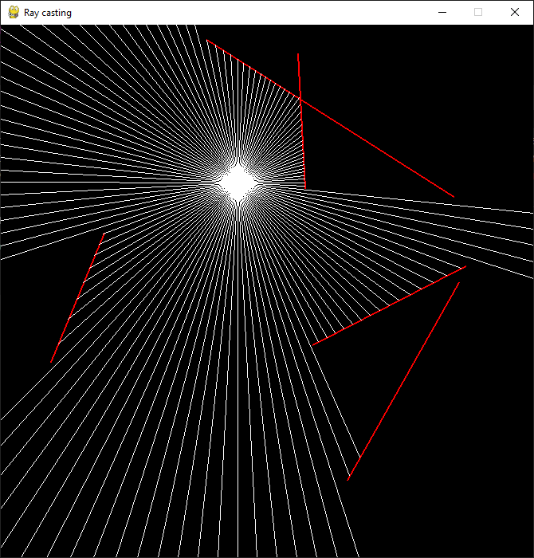
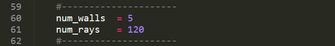
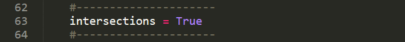
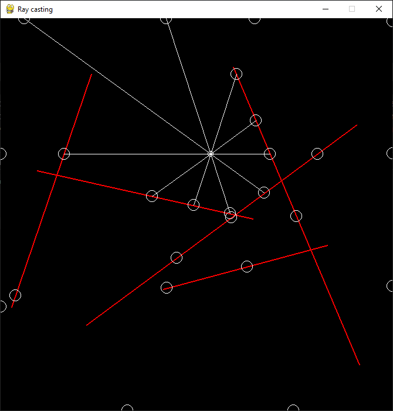

#Raycasting 2d with Pygame
This is a basic simulation of raycasting in 2D using the [Pygame](https://www.pygame.org/wiki/about "Pygame site") library; you can install this library using pip:

`$pip install pygame`

The pointer works as a spotlight from which rays of light come out

You can change the number of rays and the number of walls by changing the value of their parameters in the code:

to visualize the [intersection points between the segments](https://en.wikipedia.org/wiki/Line-line_intersection "the intersection points between the segments") change the value of the variable "intersections" to True in the code:

